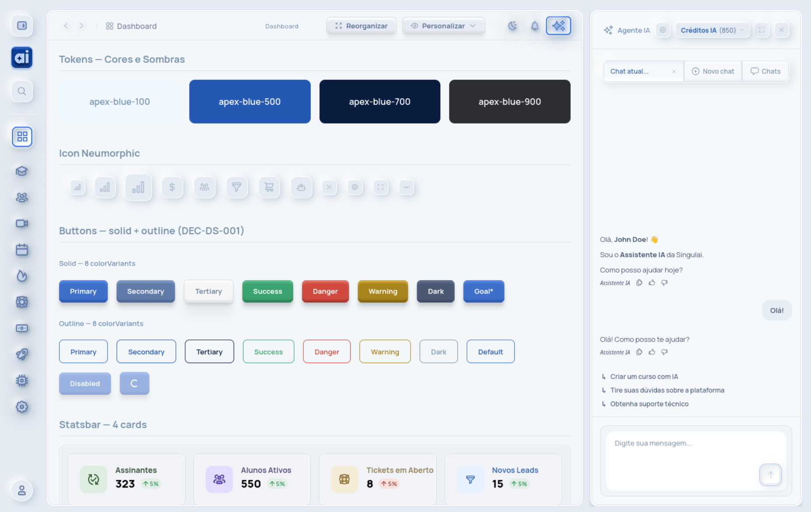

# Singulai Design System

> Angular 20 · Standalone Components · Signals · Neumorphic

[](https://design.singulai.ai)
[](#-status-stable-beta--40-componentes-em-produção)
[](#catálogo-completo-40)
[](./LICENSE)
[](https://angular.dev)
[](https://www.npmjs.com/package/@dgplsoares/singulai-ui-mcp)



Design System open source para Angular 20, construído com **Standalone Components**, **Signals** e estética **neumorphic**. Nasceu da necessidade de refatorar uma plataforma SaaS multi-tenant com identidade visual consistente, e está sendo extraído gradualmente para uso público.

🌐 **Live showcase:** [design.singulai.ai](https://design.singulai.ai)

---

## 🚀 Status: Stable beta — 40 componentes em produção

Este é um **mirror read-only** do desenvolvimento ativo no monorepo Singulai. O DS está **em uso em produção** numa plataforma SaaS multi-tenant real ([singulai.ai](https://singulai.ai)) há vários meses, com 40 componentes ativos. A API segue evoluindo conforme refatoramos novas telas — novos `@Input` aparecem ocasionalmente — mas o core está estável e validado em uso real.

**Use por conta e risco.** A licença MIT permite uso livre, mas até o NPM publish oficial recomenda-se vendoring (copiar componentes específicos pro seu projeto) em vez de depender do mirror. Quando atingir v1.0 + NPM publish, este repositório passa a aceitar PRs.

| Marco | Status |
|---|---|
| Componentes em produção | ✅ **40 componentes** ([catálogo](#catálogo)) |
| Mobile responsive | ✅ |
| Split-ready (assets brandados configuráveis via `@Input`) | ✅ |
| Mirror automatizado para repo público | ✅ |
| README + LICENSE + topics | ✅ |
| **MCP server (consulta via Claude / Cursor / Continue)** | ✅ [`@dgplsoares/singulai-ui-mcp`](https://www.npmjs.com/package/@dgplsoares/singulai-ui-mcp) v0.13.0 |
| Showcase navegável em produção | ✅ [design.singulai.ai](https://design.singulai.ai) |
| NPM publish do package principal (DS Angular) | 🟡 pendente |
| Documentação por componente (Storybook ou similar) | 🟡 pendente |
| Tag v1.0 + contribuição externa habilitada | 🟡 pendente |

---

## 🤖 Use com AI agents (MCP server)

Este DS expõe um [MCP (Model Context Protocol)](https://modelcontextprotocol.io/) server público — qualquer AI agent compatível (**Claude Desktop**, **Claude Code**, **Cursor**, **Continue**) pode consultar o catálogo via tools padronizadas:

- _"Quais componentes existem?"_ → tool retorna catálogo completo
- _"Componente para botão com loading?"_ → tool retorna `<ds-button>` + props + exemplo
- _"Quais @Input em `<ds-form-field>`?"_ → tool retorna lista tipada

### Instalação rápida

**Claude Code** (`~/.claude.json` via CLI):
```bash
claude mcp add --scope user singulai-ui -- npx -y @dgplsoares/singulai-ui-mcp
```

**Claude Desktop** (`claude_desktop_config.json`):
```json
{
  "mcpServers": {
    "singulai-ui": {
      "command": "npx",
      "args": ["-y", "@dgplsoares/singulai-ui-mcp"]
    }
  }
}
```

**Cursor / Continue / outros clientes MCP:** instruções completas em [github.com/dgplsoares/singulai-ui-mcp](https://github.com/dgplsoares/singulai-ui-mcp).

---

## ✨ Componentes

Todos os 40 componentes são **standalone** (não requerem módulo), usam **signals** para state e expõem `@Input` opcionais para customização de assets brandados — isso permite consumir o DS em apps com identidade visual diferente sem fork.

### Catálogo completo (40)

#### Layout & navegação

| Componente | Função |
|---|---|
| `<ds-page-layout>` | Skeleton de tela autenticada (sidebar + header + main + nav-footer mobile + AI Assistant overlay) |
| `<ds-page-header>` | Header sticky com breadcrumbs + actions + variants `module-dashboard` / `screen-list` / `screen-create` / `screen-detail` |
| `<ds-page-nav>` | Nav horizontal de steps para wizards (Cursos / Mentorias / Eventos) — pixel-perfect Figma |
| `<ds-page-footer-sticky>` | Footer sticky com split-button Cancelar/Salvar + dropdown de ações secundárias |
| `<ds-sidebar-left-nav>` | Sidebar collapse/expand com submenus mutex, persistência em localStorage |
| `<ds-nav-footer>` | Bottom navigation mobile com 5 botões + painéis projetáveis (mutex) |
| `<ds-step-tabs>` | Step tabs neumorphic para offcanvas/wizards multi-step (NOVO E.6.A) |

#### Forms & inputs

| Componente | Função |
|---|---|
| `<ds-form-field>` | Campo unificado (text / textarea / select / toggle / search) com ControlValueAccessor + hint + errorMessage |
| `<ds-form-section>` | Card section colapsável com header neumorphic + chevron toggle + animação grid-template-rows |
| `<ds-image-dropzone>` | Drag-and-drop upload neumorphic com toggle URL manual + progress bar + preview overlay |
| `<ds-filter-dropdown>` | Filtro overlay single/multi-select com checkboxes round neumorphic + click outside / ESC |
| `<ds-dropdown-menu>` | Overlay menu reusável ancorado em trigger projetado (CDK Overlay) |
| `<ds-segmented-tabs>` | Tabs segmentados pill-style com items closable + radius dinâmico baseado em $first/$last |
| `<ds-segmented-button>` | Botões segmentados 2-níveis (substitui segmented-tabs em layouts mais densos) |
| `<ds-type-picker>` | Cards 104×99 para seleção de tipo/kind (Videoaula / Ebook / Quiz / Texto) com discriminated union |

#### Botões & ações

| Componente | Função |
|---|---|
| `<ds-button>` | Botão unificado — 14 variants × 11 cores semânticas (primary-cta / solid / outline / action / action-icon / action-add / submit / sidebar / nav-tab / pagination / toggle-status) |
| `<ds-ai-assistant-button>` | Toggle do AI Assistant para o combo do header (32px, triple-ring neumorphic) |
| `<ds-dark-mode-button>` | Toggle de tema (composite SVG neumorphic) |
| `<ds-notifications-button>` | Sino de notificações para o combo do header |

#### Containers & cards

| Componente | Função |
|---|---|
| `<ds-card>` | Container genérico — 5 variants de chrome (default / dashboard / with-tabs / simple / inner-card) |
| `<ds-card-panel>` | Painel containerizado simples com título obrigatório + loading state |
| `<ds-offcanvas>` | Painel lateral deslizante — 4 posições × 5 sizes + backdrop + ESC + focus trap + body lock |
| `<ds-modal-confirm>` | Modal de confirmação centralizado — 4 variants semânticas (info / success / warning / danger) |

#### Data display

| Componente | Função |
|---|---|
| `<ds-datatable>` | Tabela com toolbar (search + filter + count + add) + pagination footer pixel-perfect + custom cells (badge / avatar / progress / switch / dateRelative) |
| `<ds-chart>` | Wrapper config-only sobre Chart.js v4.5 — 5 tipos (line / bar / area / pie / doughnut) + chrome neumorphic |
| `<ds-kanban-board>` | Quadro Kanban genérico `T extends {id}` — drag-drop CDK + WIP limit + template customizável + variantes semânticas |
| `<ds-pipeline-funnel>` | Lista vertical de buckets com label + value + delta + progress bar colorida (8 variants) |
| `<ds-stats-bar>` | Container slot-based para barra horizontal de N `<ds-statsbar-card>` (auto-grid responsivo) |
| `<ds-statsbar-card>` | Card de KPI com delta (seta up/down) + ícone neumorphic + polaridade invertida opcional |
| `<ds-accordion>` | Accordion de módulos com items tipados (discriminated union: ebook / aula / quiz / custom) — drag-drop optional |
| `<ds-accordion-item>` | Item standalone do accordion (uso fora de `<ds-accordion>`) |

#### Feedback & status

| Componente | Função |
|---|---|
| `<ds-toast>` + `<ds-toast-host>` | Toast notification — 4 variants × ARIA assertive/polite. Host singleton consome `ToastService` |
| `<ds-badge>` | Badge pill/rounded — 8 variants de cor × 2 sizes × 2 shapes |
| `<ds-empty-state>` | Placeholder para listagens vazias + busca sem resultado + erro de carregamento |
| `<ds-skeleton>` | Placeholder shimmer reutilizável — 3 primitivos + 5 composites pre-baked (card / row / chart / statsbar / list-item) |
| `<ds-progress-bar>` | Barra de progresso neumórfica — 8 variants × 3 sizes |
| `<ds-thumbnail-avatar>` | Avatar quadrado-arredondado com gradient azul + iniciais OU imagem |
| `<ds-icon-neumorphic>` | Ícone em moldura neumorphic — 3 sizes × 7 variants de cor |

#### Especiais

| Componente | Função |
|---|---|
| `<ds-ai-assistant-panel>` | Painel lateral do Agente IA — tabs (current/new/chats) + créditos pill + actions + timeline + composer + modo embedded mobile |

> Cobertura completa: descrições, props tipados, outputs e exemplos disponíveis via [`@dgplsoares/singulai-ui-mcp`](https://www.npmjs.com/package/@dgplsoares/singulai-ui-mcp) — peça ao seu AI agent _"quais @Input em ds-X?"_ ou abra o [showcase](https://design.singulai.ai/design-system) navegável.

---

## 🎨 Princípios de design

- **Neumorphic sutil** — sombras duplas (luz + sombra) em superfícies claras, evitando o "neumorphism gritante" típico de 2020
- **Mobile-first com `100dvh`** — viewport dinâmico, `overscroll-behavior: none`, app-feel real em Android Chrome
- **Tokens em CSS variables** — temas trocáveis sem rebuild
- **Aspect ratio explícito em SVGs** — todo `` recebe `width` e `height` HTML attrs para evitar render distorcido em mobile

---

## 🛠 Stack

- **[Angular 20](https://angular.dev)** com standalone components + signals
- **[@ng-icons/heroicons](https://github.com/ng-icons/ng-icons)** para iconografia
- **SCSS** com tokens em CSS variables (sem Tailwind dentro do DS)
- **Manrope** + **Plus Jakarta Sans** como fontes principais

---

## 🔗 Como funciona o mirror

Este repositório é gerado automaticamente via `git subtree split` a partir do diretório `frontend/src/design-system/` do monorepo Singulai. A cada commit em `main` que toca neste diretório, um GitHub Action espelha o conteúdo aqui.

- **Histórico:** apenas commits que tocaram em design-system (sem ruído do monorepo)
- **Autoria:** preservada por commit (force push é só mecânica do mirror)
- **PRs neste repositório:** ficam abertos sem merge até v1.0 — discussões e issues são bem-vindos

---

## 📜 License

[MIT](./LICENSE) — use, modifique, distribua livremente. Crédito é apreciado mas não obrigatório.

---

## 👤 Autor

Construído por **[Diogo Soares](https://www.linkedin.com/in/dgsoares/)** durante a evolução da plataforma [Singulai](https://singulai.ai) (SaaS de cursos online com IA, multi-tenant).

- LinkedIn: [@dgsoares](https://www.linkedin.com/in/dgsoares/)
- GitHub: [@dgplsoares](https://github.com/dgplsoares)

---

## 🗺 Roadmap público

| Fase | Estado |
|---|---|
| **Showcase pública** ([design.singulai.ai](https://design.singulai.ai)) | ✅ |
| **Mirror automatizado** (este repositório) | ✅ |
| **README + LICENSE + topics** | ✅ |
| **MCP server** ([`@dgplsoares/singulai-ui-mcp`](https://www.npmjs.com/package/@dgplsoares/singulai-ui-mcp) v0.13.0) | ✅ |
| **40 componentes em produção** | ✅ |
| **Posts de lançamento** (LinkedIn, dev.to, Reddit) | 🟡 |
| **NPM publish do package principal** (após API estabilizar) | 🟡 |
| **Documentação por componente** (Storybook ou alternativa) | 🟡 |
| **Tag v1.0** + PRs externos habilitados | 🟡 |

---

> _Made with care in 🇧🇷._
